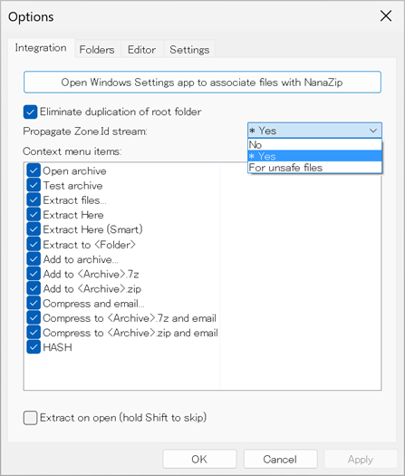

# Windows の圧縮展開ソフトウェアの Mark of the Web (MOTW) 伝播のサポートに関する比較

[English](README.md) | Japanese

## 背景
2022年3月3日にマイクロソフト社は Windows 上の Office アプリケーションについて、インターネットからダウンロードされたファイル(メールの添付ファイルなど)のマクロをブロックするようにデフォルトの動作を変更することを[発表しました](https://docs.microsoft.com/ja-jp/deployoffice/security/internet-macros-blocked)。

発表内容の抜粋:
> VBA マクロは、悪意のあるアクターがマルウェアやランサムウェアをデプロイするためのアクセス権を取得する一般的な方法です。 そのため、Office のセキュリティを向上させるために、Office アプリケーションの既定の動作を変更して、インターネットからファイル内のマクロをブロックしています。
>
> ...
>
> この変更は、Windows を実行しているデバイスの Office にのみ影響し、Access、Excel、PowerPoint、Visio、Word の各アプリケーションにのみ影響します。
>
> この変更は、2022年4月初旬の Current Channel (プレビュー) 以降、バージョン2203でロールアウトを開始します。 その後、この変更は、最新チャネルや月次エンタープライズ チャネルなどの他の更新チャネルで利用できるようになります。

これは悪意のある Office ドキュメントに対する防御の素晴らしい改善です。

この発表によると、マクロをブロックするかどうかはファイルの MOTW (Mark of the Web) 属性に基づきます。ウェブブラウザやメールクライアントなどのアプリケーションはインターネットからダウンロードしたファイルやメールの添付ファイルに MOTW を付けます。MOTW は NTFS 代替データストリームの Zone.Identifier に保存されます。

圧縮ファイルから展開された悪意のある Office ドキュメントのマクロをブロックするためには、圧縮展開ソフトウェアは圧縮ファイルに MOTW が付いている場合に展開したファイルにも MOTW を伝播させる必要があります。もし圧縮展開ソフトウェアが MOTW を伝播しなければ圧縮ファイル中の悪意のある Office ドキュメントはブロックを回避することができてしまいます。

ここで一つの疑問が思い浮かびました。**「どの圧縮展開ソフトウェアが展開したファイルに MOTW を伝播させるんだろう?」** そこで私はいくつかの圧縮展開ソフトウェアをテストしてその結果をまとめました。

## MOTW 伝播のサポートの比較表 (2025年10月4日時点)
|名称|テストしたバージョン|ライセンス|MOTWの伝播|デフォルトで有効|備考|
|----|----------------|--------|---------|--------------|----|
|Windowsのエクスプローラの「すべて展開」|Windows 11 24H2|有償|する :heavy_check_mark:|有効 :heavy_check_mark:||
|[7-Zip](https://www.7-zip.org/)|25.01|GNU LGPL|する :heavy_check_mark:|無効 :x: <a href="#*1">*1</a>||
|[Bandizip](https://en.bandisoft.com/bandizip/)|Standard Edition 7.40|フリーウェア|する :heavy_check_mark:|有効 :heavy_check_mark:|特定のファイル拡張子のみ <a href="#*2">*2</a>|
|[CubeICE](https://www.cube-soft.jp/cubeice/)|3.5.1|フリーウェア(有償版もあり)|する :heavy_check_mark:|有効 :heavy_check_mark:||
|[Explzh](https://www.ponsoftware.com/en/)|9.87|商用利用は有償|する :heavy_check_mark:|有効 :heavy_check_mark:||
|[NanaZip](https://github.com/M2Team/NanaZip)|6.0 Preview 1 (6.0.1461.0)|MIT|する :heavy_check_mark:|有効 :heavy_check_mark:|特定のファイル拡張子に限定する設定が可能 <a href="#*3">*3</a>|
|[PeaZip](https://peazip.github.io/)|10.6.1|GNU LGPL|する :heavy_check_mark:|有効 :heavy_check_mark:||
|[TC4Shell](https://www.tc4shell.com/)|21.3.0 (試用版)|有償|する :heavy_check_mark:|有効 :heavy_check_mark:||
|[Total Commander](https://www.ghisler.com/)|11.56 (試用版)|有償|する :heavy_check_mark:|有効 :heavy_check_mark:||
|[WinRAR](https://www.win-rar.com/)|7.13 (試用版)|有償|する :heavy_check_mark:|有効 :heavy_check_mark:|デフォルトは特定のファイル拡張子のみ <a href="#*4">*4</a>|
|[WinZip](https://www.winzip.com/)|77.0 (試用版)|有償|する :heavy_check_mark:|有効 :heavy_check_mark:||
|[Ashampoo ZIP Free](https://www.ashampoo.com/en-us/zip-free)|1.0.7|フリーウェア (登録が必要)|しない :x:|||
|[CAM UnZip](https://www.camunzip.com/)|5.25.4.0|商用利用は有償|しない :x:|||
|[PowerShell](https://github.com/PowerShell/PowerShell/) の Expand-Archive コマンドレット|7.5.3|MIT|しない :x:|||
|[Express Zip](https://www.nchsoftware.com/zip/)|11.28|商用利用は有償|しない :x:|||
|[IZArc](https://www.izarc.org/)|4.6|フリーウェア|しない :x:||"Propagate Mark of the Web"のオプションがあるが伝播しない <a href="#*5">*5</a>|
|[LhaForge](https://claybird.sakura.ne.jp/garage/lhaforge/index.html)|2.0.1|MIT|しない :x:|||
|[Lhaplus](https://www7a.biglobe.ne.jp/~schezo/)|1.74|フリーウェア|しない :x:|||
|[PowerArchiver](https://www.powerarchiver.com/)|22.00.11 (試用版)|有償|しない :x:|||
|[StuffIt Expander](https://stuffit.com/)|15.0.8|フリーウェア|しない :x:|||
|Windows 11の [tar.exe (bsdtar)](https://github.com/libarchive/libarchive)|3.8.1|BSD 2-clause|しない :x:|||
|[Universal Extractor 2](https://github.com/Bioruebe/UniExtract2)|2.0.0 RC 3|GNU GPLv2|しない :x:|||
|[ZipGenious](https://zipgenius.it/en/)|6.3.2.3116|フリーウェア|しない :x:|||
|[Zipware](https://www.zipware.org/)|1.6|フリーウェア|しない :x:|||
|[ファイルコンパクト](https://www.sourcenext.com/product/pc/oth/pc_oth_001267/)|7.02|有償|しない :x:|||

<a id="*1">*1</a>: 7-Zip はバージョン 22.00 から MOTW の伝播をサポートしましたが、デフォルトで無効になっています。7-Zip の GUI については 7-Zip File Manager の「ツール」→「オプション」→「7-Zip」にある「Zone.Id ストリームの伝達:」で MOTW の伝播を有効にできます。

オプションを「はい(Y)」に設定した場合は MOTW が全ての展開されたファイルに伝播されます。「Office ファイルの場合」に設定した場合は以下のファイル拡張子のファイルに MOTW が伝播されます:
- .doc .docb .docm .docx .dot .dotm .dotx .wbk .wll .wwl
- .pot .potm .potx .ppa .ppam .pps .ppsm .ppsx .ppt .pptm .pptx .sldm .sldx
- .xla .xlam .xlm .xls .xlsb .xlsm .xlsx .xlt .xltm .xltx

MOTW の伝播はレジストリの HKEY_CURRENT_USER\SOFTWARE\7-Zip\Options\WriteZoneIdExtract に 1 の DWORD 値を設定することでも有効にできます。

7-Zip の CLI については、上記のオプションの設定に関係なく -snz のコマンドラインオプションが必要です。

<a id="*2">*2</a>: [Bandizip のドキュメント](https://www.bandisoft.com/bandizip/help/zone-identifier/)によると、Bandizip は以下のファイル拡張子のファイルに MOTW を伝播します:
- .exe .com .msi .scr .bat .cmd .pif .bat .lnk
- .zip .zipx .rar .7z .alz .egg .cab .bh
- .iso .img .isz .udf .wim .bin .i00
- .js .jse .vbs .vbe .wsf
- .url .reg
- .docx .doc .xls .xlsx .ppt .pptx .wiz

私は以前にテキストファイルのみを含む ZIP ファイルで Bandizip をテストしていたため、Bandizip が MOTW を伝播しないと誤解していました。

<a id="*3">*3</a>: NanaZip はバージョン 6.0 Preview 1 から MOTW の伝播がデフォルトで有効になりました。NanaZip の GUI の「オプション」→「Integration」にある「Zone.Id ストリームの伝達」で MOTW の伝播の設定を変更できます。

「Office ファイルの場合」に設定した場合は、NanaZip は以下のファイル拡張子のファイルに MOTW を伝播します:
- .doc .dot .wbk
- .docx .docm .dotx .dotm .docb .wll .wwl
- .xls .xlt .xlm
- .xlsx .xlsm .xltx .xltm .xlsb .xla .xlam
- .ppt .pot .pps .ppa .ppam
- .pptx .pptm .potx .potm .ppam .ppsx .ppsm .sldx .sldm
- .bat .cmd .com .exe .hta .js .jse .lnk .msi .pif .ps1 .scr .vbe .vbs .wsf
- .7z .iso .rar .tar .vhd .vhdx .zip

NanaZipはレジストリで[システム全体のポリシー設定](https://github.com/M2Team/NanaZip/blob/main/Documents/Policies.md#propagate-zoneid-stream)が可能です。システム全体のポリシー設定はユーザの設定より優先されます。

<a id="*4">*4</a>: WinRAR 7.0で"Mark of the Webを伝播"のオプションが導入されました。以下の値から選択できます:
- 削除しない(「伝播しない」の誤り?、英語版では"Never")
- Officeファイル用
- 実行ファイルとOfficeファイル用
- 全ファイル用
- ユーザー定義された種類用

このオプションはWinRARのGUIでのみサポートされています。WinRARのCLIはオプションの設定に関係なくMOTWの伝播をしません。

デフォルトは「実行ファイルとOfficeファイル用」で、WinRARは以下のファイル拡張子のファイルにMOTWを伝播します:
- .exe .bat .cmd .hta .lnk .msi .pif .ps1 .scr .vbs
- .doc .docb .docm .docx .dot .dotm .dotx .wbk
- .ppa .ppam .pot .potm .potx .pps .ppsm .ppsx .ppt .pptm .pptx .sldm .sldx
- .xls .xlsb .xlsm .xlsx .xlm .xlt .xltm .xltx

「Officeファイル用」に設定すると、WinRARは以下のファイル拡張子のファイルにMOTWを伝播します:
- .doc .docb .docm .docx .dot .dotm .dotx .wbk
- .ppa .ppam .pot .potm .potx .pps .ppsm .ppsx .ppt .pptm .pptx .sldm .sldx
- .xls .xlsb .xlsm .xlsx .xlm .xlt .xltm .xltx

「ユーザー定義された種類用」に設定するとファイル拡張子を指定できます。

<a id="*5">*5</a>: IZArc バージョン4.6で"Propagate Mark of the Web"のオプションが導入されました。デフォルトでは有効ですが、実際にはオプションの設定に関係なくMOTWの伝播は機能していないようです。

## MOTW 伝播の動作の比較表 (2025年10月4日時点)
|名称|テストしたバージョン|MOTW 伝播の動作|
|----|--------------|-------------------------|
|Windowsのエクスプローラの「すべて展開」|Windows 11 24H2|<ul><li>MOTW は ZoneId の値が 3 (インターネット) または 4 (信頼されていないサイト) の場合にのみ伝播されます。</li><li>圧縮ファイルの ZoneId のフィールドが引き継がれます。</li><li>圧縮ファイルの絶対パスが ReferrerUrl のフィールドに設定されます。</li><li>他のフィールドは全て無視されます。</li><li>ZoneIdの値が4 (信頼されていないサイト)の場合に.exe .lnk .vbsファイルの展開はブロックされます。</li></ul>|
|[7-Zip](https://www.7-zip.org/)|25.01|<ul><li>圧縮ファイルの MOTW はそのまま伝播されます。</li><li>「Zone.Id ストリームの伝達:」の設定を「Office ファイルの場合」に設定した場合は特定のファイル拡張子のファイルにのみ伝播されます。 <a href="#*1">*1</a></li></ul>|
|[Bandizip](https://en.bandisoft.com/bandizip/)|Standard Edition 7.40|<ul><li>圧縮ファイルの MOTW はそのまま伝播されます。</li><li>特定のファイル拡張子のファイルにのみ伝播されます。  <a href="#*2">*2</a></li></ul>|
|[CubeICE](https://www.cube-soft.jp/cubeice/)|3.5.1|<ul><li>MOTW は ZoneId の値が 3 (インターネット) または 4 (信頼されていないサイト) の場合にのみ伝播されます。</li><li>ZoneId のフィールドのみが引き継がれて他のフィールドは全て無視されます。</li></ul>|
|[Explzh](https://www.ponsoftware.com/en/)|9.87|<ul><li>MOTW は ZoneId の値が 3 (インターネット) の場合にのみ伝播されます。</li><li>ZoneId のフィールドのみが引き継がれて他のフィールドは全て無視されます。</li></ul>|
|[NanaZip](https://github.com/M2Team/NanaZip)|6.0 Preview 1 (6.0.1461.0)|<ul><li>圧縮ファイルの MOTW はそのまま伝播されます。</li><li>「Zone.Id ストリームの伝達」の設定を「Office ファイルの場合」に設定した場合は特定のファイル拡張子のファイルにのみ伝播されます。 <a href="#*3">*3</a></li></ul>|
|[PeaZip](https://peazip.github.io/)|10.6.1|<ul><li>圧縮ファイルの MOTW はそのまま伝播されます。</li></ul>|
|[TC4Shell](https://www.tc4shell.com/)|21.3.0 (試用版)|<ul><li>ZoneId のフィールドのみが引き継がれて他のフィールドは全て無視されます。</li></ul>|
|[Total Commander](https://www.ghisler.com/)|11.56 (試用版)|<ul><li>ReferrerUrl のフィールドを除いて圧縮ファイルの MOTW はそのまま伝播されます。</li></ul>|
|[WinRAR](https://www.win-rar.com/)|7.13 (試用版)|<ul><li>ZoneId のフィールドのみが引き継がれて他のフィールドは全て無視されます。</li><li>特定のファイル拡張子のファイルにのみ伝播されます。 <a href="#*4">*4</a></li></ul>|
|[WinZip](https://www.winzip.com/)|77.0 (試用版)|<ul><li>MOTW は ZoneId の値が 3 (インターネット) または 4 (信頼されていないサイト) の場合にのみ伝播されます。</li><li>圧縮ファイルの ZoneId のフィールドが引き継がれます。</li><li>圧縮ファイルの絶対パスが ReferrerUrl のフィールドに設定されます。</li><li>他のフィールドは全て無視されます。</li>><li>ZoneIdの値が4 (信頼されていないサイト)の場合に.exe .lnk .vbsファイルの展開はブロックされます。</li></ul>|

### MOTW 伝播の例
これらの例では、MOTW が Set-MOTW.ps1 で motw-test.zip の ZIP ファイルに手動でセットされ、続いて展開されたファイルの MOTW が Get-MOTW.ps1 で表示されています。Set-MOTW.ps1 と Get-MOTW.ps1 は私の [PS-MOTW](https://github.com/nmantani/PS-MOTW) のリポジトリで公開しています。

- Windows のエクスプローラまたは WinZip (バージョン28.0を除く) で展開されたファイルの MOTW:

- 7-Zip、Bandizip、NanaZip、または PeaZip で展開されたファイルの MOTW:

- CubeICE, Explzh、TC4Shell、または WinRAR で展開されたファイルの MOTW:

- Total Commander で展開されたファイルの MOTW:

## FAQ
- ### MOTW (Mark of the Web) とは何ですか?
  以下のブログ記事をご覧ください:
  - [Details about the Mark-of-the-Web (MOTW)](https://nolongerset.com/mark-of-the-web-details/) by Mike Wolfe ([@NoLongerSet](https://twitter.com/NoLongerSet))
  - [Downloads and the Mark-of-the-Web](https://textslashplain.com/2016/04/04/downloads-and-the-mark-of-the-web/) by Eric Lawrence ([@ericlaw](https://twitter.com/ericlaw))
  - [Mark-of-the-Web from a red team’s perspective](https://outflank.nl/blog/2020/03/30/mark-of-the-web-from-a-red-teams-perspective/) by Stan Hegt ([@stanhacked](https://twitter.com/stanhacked))

  これらは MOTW について理解するのにとても役立ちます。

- ### 私のお気に入りの圧縮展開ソフトウェアが載っていません。
  あなたのテスト結果を [Issues](https://github.com/nmantani/archiver-MOTW-support-comparison/issues) または [Pull requests](https://github.com/nmantani/archiver-MOTW-support-comparison/pulls) で提供してください。私は日本人ですので比較表にはあなたがご存じないかもしれない日本の圧縮展開ソフトウェアがいくつか載っています。

- ### どうすれば私のお気に入りの圧縮展開ソフトウェアをテストできますか?
  [Details about the Mark-of-the-Web (MOTW)](https://nolongerset.com/mark-of-the-web-details/) をご覧ください。こちらでは Windows のエクスプローラと 7-Zip の動作を比較しています。あなたのお気に入りの圧縮展開ソフトウェアも同様にテストできます。

  私は [PS-MOTW](https://github.com/nmantani/PS-MOTW) という手動で MOTW を設定、表示、削除できる PowerShell スクリプトを作りました。これを圧縮展開ソフトウェアのテストに使うことができます。

- ### 情報が誤っているまたは古いです。
  詳細について [Issues](https://github.com/nmantani/archiver-MOTW-support-comparison/issues) でご提供いただくか [Pull requests](https://github.com/nmantani/archiver-MOTW-support-comparison/pulls) で修正案をご提供ください。

- ### ディスクイメージファイル (.iso ファイルや .vhd ファイル等) 中の悪意のある Office ドキュメントはブロックを回避できますか?
  ~~はい。もしディスクイメージファイルが NTFS 代替データストリームをサポートしていない場合は、MOTW はディスクイメージファイル中のファイルには付けられません。以下を参照してください:~~
  - [Mark-of-the-Web from a red team’s perspective](https://outflank.nl/blog/2020/03/30/mark-of-the-web-from-a-red-teams-perspective/) by Stan Hegt ([@stanhacked](https://twitter.com/stanhacked))
  - [The Dangers of VHD and VHDX Files](https://insights.sei.cmu.edu/blog/the-dangers-of-vhd-and-vhdx-files/) by Will Dormann ([@wdormann](https://twitter.com/wdormann))
  - [Subvert Trust Controls: Mark-of-the-Web Bypass](https://attack.mitre.org/techniques/T1553/005/) (an article in [MITRE ATT&CK](https://attack.mitre.org/) knowledge base).

  **2022年4月11日更新:**  
  Didier Stevens 氏 ([@DidierStevens](http://twitter.com/DidierStevens)) の [.ISO Files With Office Maldocs & Protected View in Office 2019 and 2021](https://blog.didierstevens.com/2022/04/04/iso-files-with-office-maldocs-protected-view-in-office-2019-and-2021/) のブログ記事によると、Office 2019 と 2021 は MOTW が付いている ISO ファイル内に保存された Office ドキュメントを保護されたビューで開くそうです。この動作は2021年8月に導入されたとのことです。

  **2022年11月30日更新:**  
  Bill Demirkapi 氏 ([@BillDemirkapi](https://twitter.com/BillDemirkapi/)) の[ツイート](https://twitter.com/BillDemirkapi/status/1590062146486140928)によると、マイクロソフト社は2022年11月8日にリリースされたセキュリティ更新プログラムでISOやVHD等のディスクイメージファイルの MOTW の取り扱いを修正しました。アプリケーションがインターネットからダウンロードしたディスクイメージファイル内のファイルを開く際はそのディスクイメージファイルの MOTW が適用されるようになります。

## 参考資料
- Macros from the internet will be blocked by default in Office  
https://docs.microsoft.com/en-us/deployoffice/security/internet-macros-blocked

- Details about the Mark-of-the-Web (MOTW)  
https://nolongerset.com/mark-of-the-web-details/

- Downloads and the Mark-of-the-Web  
https://textslashplain.com/2016/04/04/downloads-and-the-mark-of-the-web/

- Mark-of-the-Web from a red team’s perspective  
https://outflank.nl/blog/2020/03/30/mark-of-the-web-from-a-red-teams-perspective/

- The Dangers of VHD and VHDX Files  
https://insights.sei.cmu.edu/blog/the-dangers-of-vhd-and-vhdx-files/

- Subvert Trust Controls: Mark-of-the-Web Bypass  
https://attack.mitre.org/techniques/T1553/005/

## 作者
萬谷 暢崇 ([@nmantani](https://twitter.com/nmantani))
