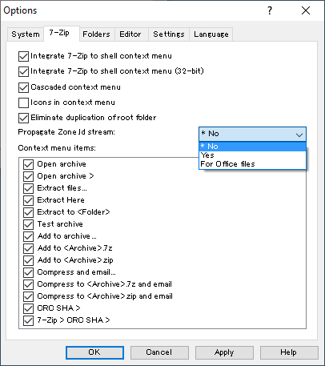
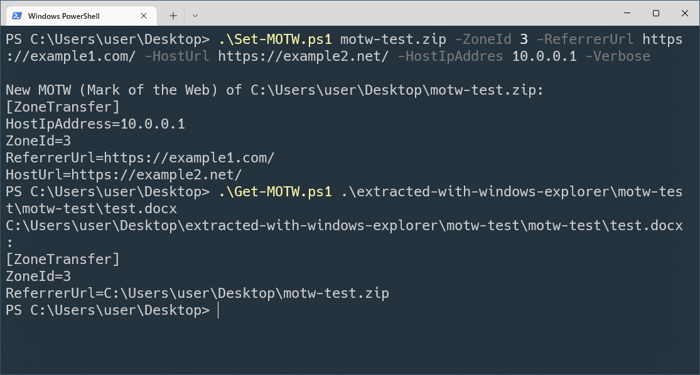
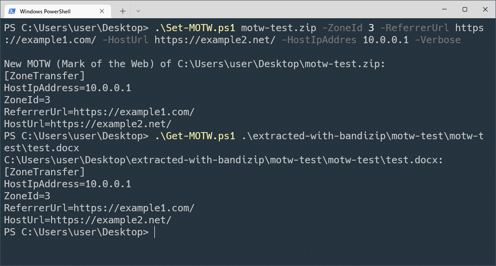
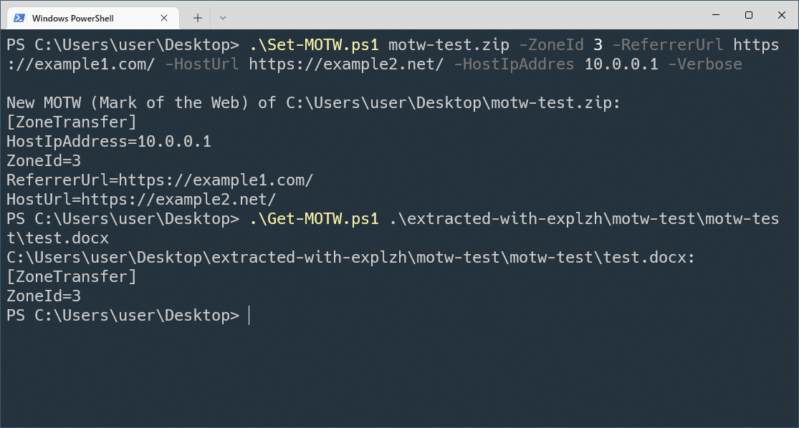

# Comparison of MOTW (Mark of the Web) propagation support of archiver software for Windows

## Background
On 3 March 2022, Microsoft [announced](https://docs.microsoft.com/en-us/deployoffice/security/internet-macros-blocked) that the default behavior of Office applications on Windows will be changed to block macros in files from the internet (such as email attachment).

An excerpt from the announcement:
> VBA macros are a common way for malicious actors to gain access to deploy malware and ransomware. Therefore, to help improve security in Office, we’re changing the default behavior of Office applications to block macros in files from the internet.
>
> ...
>
> This change only affects Office on devices running Windows and only affects the following applications: Access, Excel, PowerPoint, Visio, and Word.
>
> The change will begin rolling out in Version 2203, starting with Current Channel (Preview) in early April 2022. Later, the change will be available in the other update channels, such as Current Channel and Monthly Enterprise Channel.

This is a great improvement of defense against malicious Office document files.

According to the announcement, whether blocking macro or not is determined based on MOTW (Mark of the Web) attribute of the file. Applications such as web browsers and email clients put MOTW on downloaded files and email attachments that come from the internet. MOTW is stored in Zone.Identifier NTFS alternate data stream.

To block macro of malicious Office document files that are extracted from archive files, an archiver software has to propagate MOTW to extracted files when an archive file has MOTW. If archiver software does not propagate MOTW, malicious Office documents in archive files can circumvent blocking.

A question came up: **"What archiver software can propagate MOTW to extracted files?"** So I tested some archiver software and summarized the result.

## Comparison table of MOTW propagation support (as of 22 June 2022)
|Name|Tested version|License|MOTW propagation|Note|
|----|--------------|-------|----------------|----|
|"Extract all" built-in function of Windows Explorer|Windows 10 21H2|proprietary|Yes :heavy_check_mark:||
|[7-Zip](https://www.7-zip.org/)|22.00|GNU LGPL|Yes :heavy_check_mark:|Disabled by default <a href="#*1">*1</a>|
|[Bandizip](https://en.bandisoft.com/bandizip/)|Standard Edition 7.25|freeware|Yes :heavy_check_mark:|Only for specific file extensions <a href="#*2">*2</a>|
|[Explzh](https://www.ponsoftware.com/en/)|8.65|proprietary for commercial use|Yes :heavy_check_mark:||
|[WinRAR](https://www.win-rar.com/)|6.11 (trial)|proprietary|Yes :heavy_check_mark:|Only for specific file extensions <a href="#*3">*3</a>|
|[WinZip](https://www.winzip.com/)|26.0 (trial)|proprietary|Yes :heavy_check_mark:||
|[Ashampoo ZIP Free](https://www.ashampoo.com/en-us/zip-free)|1.0.7|freeware (registration required)|No :x:||
|[CAM UnZip](https://www.camunzip.com/)|5.22.6.0|proprietary for commercial use|No :x:||
|[CubeICE](https://www.cube-soft.jp/cubeice/)|1.1.1|freeware|No :x:||
|Expand-Archive cmdlet of [PowerShell](https://github.com/PowerShell/PowerShell/)|7.2.4|MIT|No :x:||
|[IZArc](https://www.izarc.org/)|4.5|freeware|No :x:||
|[LhaForge](https://claybird.sakura.ne.jp/garage/lhaforge/index.html)|1.6.7|MIT|No :x:||
|[Lhaplus](http://hoehoe.com/)|1.74|freeware|No :x:||
|[NanaZip](https://github.com/M2Team/NanaZip)|1.2.252.0|MIT|No :x:||
|[PeaZip](https://peazip.github.io/)|8.6.0|GNU LGPL|No :x:||
|[PowerArchiver](https://www.powerarchiver.com/)|21.00.15 (trial)|proprietary|No :x:||
|[StuffIt Expander](https://stuffit.com/)|15.0.8|freeware|No :x:||
|[tar.exe (bsdtar)](https://github.com/libarchive/libarchive) of Windows 10|3.5.2|BSD 2-clause|No :x:||
|[ZipGenious](https://zipgenius.com/)|6.3.2.3116|freeware|No :x:||
|[Zipware](https://www.zipware.org/)|1.6|freeware|No :x:||

<a id="*1">*1</a>: Though 7-Zip has supported MOTW propagation since version 22.00, it is disabled by default. You can enable it with the "Propagate Zone Id stream:" option in "Tools" -> "Options" -> "7-Zip" of 7-Zip File Manager.

When you set the option to Yes, 7-Zip propagate MOTW to all extracted files. When you set it to "For Office files", 7-Zip propagate MOTW to files with the following file extensions:
- .doc .docb .docm .docx .dot .dotm .dotx .wbk .wll .wwl
- .pot .potm .potx .ppa .ppam .pps .ppsm .ppsx .ppt .pptm .pptx .sldm .sldx
- .xla .xlam .xlm .xls .xlsb .xlsm .xlsx .xlt .xltm .xltx

You can also enable MOTW propagation by setting the registry HKEY_CURRENT_USER\SOFTWARE\7-Zip\Options\WriteZoneIdExtract DWORD to 1.

<a id="*2">*2</a>: Accoring to [the document of Bandizip](https://www.bandisoft.com/bandizip/help/zone-identifier/), Bandizip propagates MOTW to files with the following file extensions:
- .exe .com .msi .scr .bat .cmd .pif .bat .lnk
- .zip .zipx .rar .7z .alz .egg .cab .bh
- .iso .img .isz .udf .wim .bin .i00
- .js .jse .vbs .vbe .wsf
- .url .reg
- .docx .doc .xls .xlsx .ppt .pptx .wiz

I previously tested Bandizip with a ZIP archive file that contained only text files, and I misunderstood that Bandizip does not propagate MOTW.

<a id="*3">*3</a>: Jernej Simončič ([@jernej__s](https://twitter.com/jernej__s)) kindly contacted the developer of WinRAR and got [the answer](https://github.com/nmantani/archiver-MOTW-support-comparison/issues/1) that WinRAR propagates MOTW only to Microsoft Office document files. It seems that the supported file types are not documented. I did additional tests with WinRAR 6.11 and confirmed that it propagates MOTW to document files of Word, Excel, and PowerPoint (files of Access and Publisher are not supported).

I previously tested WinRAR with a ZIP archive file that contained only text files, and I misunderstood that WinRAR does not propagate MOTW.

## Comparison table of MOTW propagation behavior (as of 22 June 2022)
|Name|Tested version|MOTW propagation behavior|
|----|--------------|-------------------------|
|"Extract all" built-in function of Windows Explorer|Windows 10 21H2|<ul><li>MOTW is propagated only if ZoneId value of the MOTW is 3 (Internet) or 4 (Untrusted sites)</li><li>ZoneId field of the archive file is inherited</li><li>The absolute path of the archive file is set for the ReferrerUrl field</li><li>All other fields are ignored</li></ul>|
|[7-Zip](https://www.7-zip.org/)|22.00|<ul><li>MOTW of the archive file is propagated without modification</li><li>Only for specific file extensions if the "Propagate Zone Id stream:" option is set to "For Office files" <a href="#*1">*1</a></li></ul>|
|[Bandizip](https://en.bandisoft.com/bandizip/)|Standard Edition 7.25|<ul><li>MOTW of the archive file is propagated without modification</li><li>Only for specific file extensions <a href="#*2">*2</a></li></ul>|
|[Explzh](https://www.ponsoftware.com/en/)|8.65|<ul><li>MOTW is propagated only if ZoneId value of the MOTW is 3 (Internet)</li><li>Only ZoneId field of the archive file is inherited and all other fields are ignored</li></ul>|
|[WinRAR](https://www.win-rar.com/)|6.11 (trial)|<ul><li>MOTW is propagated only if ZoneId value of the MOTW is 3 (Internet)</li><li>Only ZoneId field of the archive file is inherited and all other fields are ignored</li><li>Only for specific file extensions <a href="#*3">*3</a></li></ul>|
|[WinZip](https://www.winzip.com/)|26.0 (trial)|<ul><li>MOTW is propagated only if ZoneId value of the MOTW is 3 (Internet) or 4 (Untrusted sites)</li><li>ZoneId field of the archive file is inherited</li><li>The absolute path of the archive file is set for the ReferrerUrl field</li><li>All other fields are ignored</li></ul>|

### MOTW propagation examples
In these examples, MOTW was manually set for a ZIP archive file motw-test.zip with Set-MOTW.ps1, then MOTW of an extracted file is displayed with Get-MOTW.ps1. Set-MOTW.ps1 and Get-MOTW.ps1 are available at my [PS-MOTW](https://github.com/nmantani/PS-MOTW) repository.

- MOTW of a file extracted with Windows Explorer or WinZip:

- MOTW of a file extracted with 7-Zip or Bandizip:

- MOTW of a file extracted with Explzh or WinRAR:

## FAQ
- ### What is MOTW (Mark of the Web)?
  Please see these blog articles:
  - [Details about the Mark-of-the-Web (MOTW)](https://nolongerset.com/mark-of-the-web-details/) by Mike Wolfe ([@NoLongerSet](https://twitter.com/NoLongerSet))
  - [Downloads and the Mark-of-the-Web](https://textslashplain.com/2016/04/04/downloads-and-the-mark-of-the-web/) by Eric Lawrence ([@ericlaw](https://twitter.com/ericlaw))
  - [Mark-of-the-Web from a red team’s perspective](https://outflank.nl/blog/2020/03/30/mark-of-the-web-from-a-red-teams-perspective/) by Stan Hegt ([@stanhacked](https://twitter.com/stanhacked))

  They are very helpful to understand it.

- ### My favorite archiver software is not listed.
  Please provide your test result from [Issues](https://github.com/nmantani/archiver-MOTW-support-comparison/issues) or [Pull requests](https://github.com/nmantani/archiver-MOTW-support-comparison/pulls). Because I am Japanese, the comparison table contains some Japanese archiver software that you may not know.

- ### How to test my favorite archiver software?
  Please see [Details about the Mark-of-the-Web (MOTW)](https://nolongerset.com/mark-of-the-web-details/). It compares behavior of the built-in Windows unzip utility and 7-zip. You can test your favorite archiver software in a  similar fashion.

  I created [PS-MOTW](https://github.com/nmantani/PS-MOTW), PowerShell scripts to manually set / show / remove MOTW. You can use it for testing archiver software.

- ### Information is incorrect or outdated.
  Please provide the details from [Issues](https://github.com/nmantani/archiver-MOTW-support-comparison/issues) or the fix from [Pull requests](https://github.com/nmantani/archiver-MOTW-support-comparison/pulls). I am happy to fix it.

- ### Can a malicious Office document in a disk image file (such as .iso and .vhd) circumvent blocking?
  Yes. If the file format of a disk image file does not support NTFS alternate data stream, MOTW is not set for the files in the disk image file. Please see also the following:
  - [Mark-of-the-Web from a red team’s perspective](https://outflank.nl/blog/2020/03/30/mark-of-the-web-from-a-red-teams-perspective/) by Stan Hegt ([@stanhacked](https://twitter.com/stanhacked))
  - [The Dangers of VHD and VHDX Files](https://insights.sei.cmu.edu/blog/the-dangers-of-vhd-and-vhdx-files/) by Will Dormann ([@wdormann](https://twitter.com/wdormann))
  - [Subvert Trust Controls: Mark-of-the-Web Bypass](https://attack.mitre.org/techniques/T1553/005/) (an article in [MITRE ATT&CK](https://attack.mitre.org/) knowledge base).

  **Update on 11 April 2022:**  
  According to the blog article [.ISO Files With Office Maldocs & Protected View in Office 2019 and 2021](https://blog.didierstevens.com/2022/04/04/iso-files-with-office-maldocs-protected-view-in-office-2019-and-2021/) by Didier Stevens ([@DidierStevens](http://twitter.com/DidierStevens)), Office 2019 and 2021 use protected view to open Office document stored inside an ISO file with MOTW. This behavior was introduced in August 2021.

## References
- Macros from the internet will be blocked by default in Office  
https://docs.microsoft.com/en-us/deployoffice/security/internet-macros-blocked

- Details about the Mark-of-the-Web (MOTW)  
https://nolongerset.com/mark-of-the-web-details/

- Downloads and the Mark-of-the-Web  
https://textslashplain.com/2016/04/04/downloads-and-the-mark-of-the-web/

- Mark-of-the-Web from a red team’s perspective  
https://outflank.nl/blog/2020/03/30/mark-of-the-web-from-a-red-teams-perspective/

- The Dangers of VHD and VHDX Files  
https://insights.sei.cmu.edu/blog/the-dangers-of-vhd-and-vhdx-files/

- Subvert Trust Controls: Mark-of-the-Web Bypass  
https://attack.mitre.org/techniques/T1553/005/

## Author
Nobutaka Mantani ([@nmantani](https://twitter.com/nmantani))
